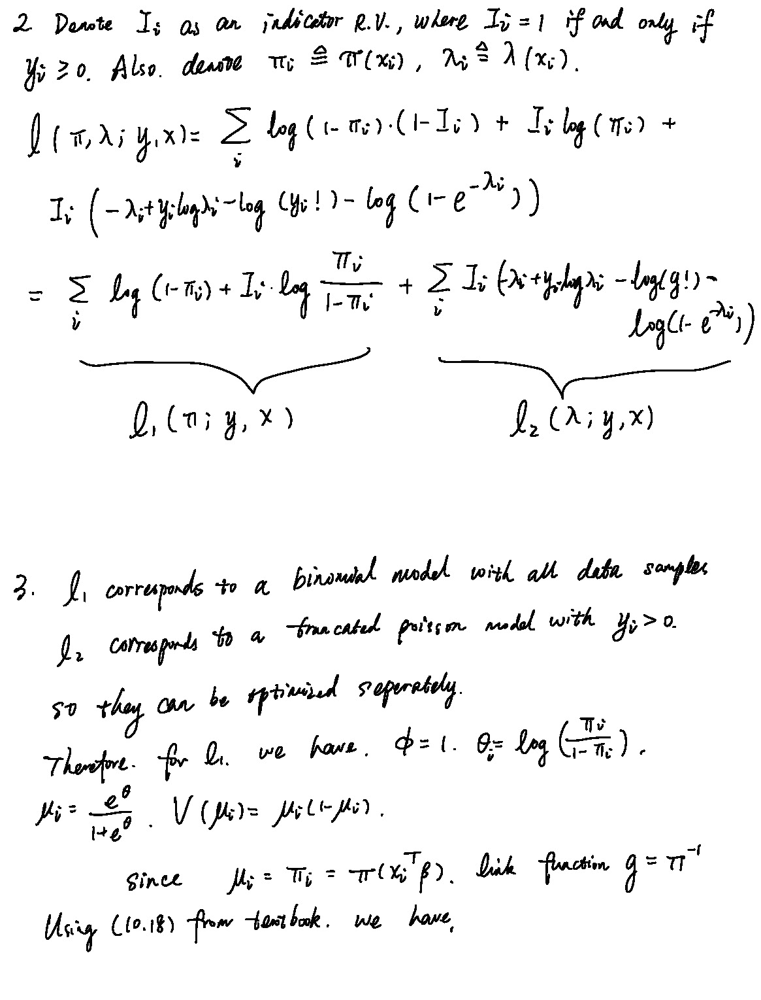
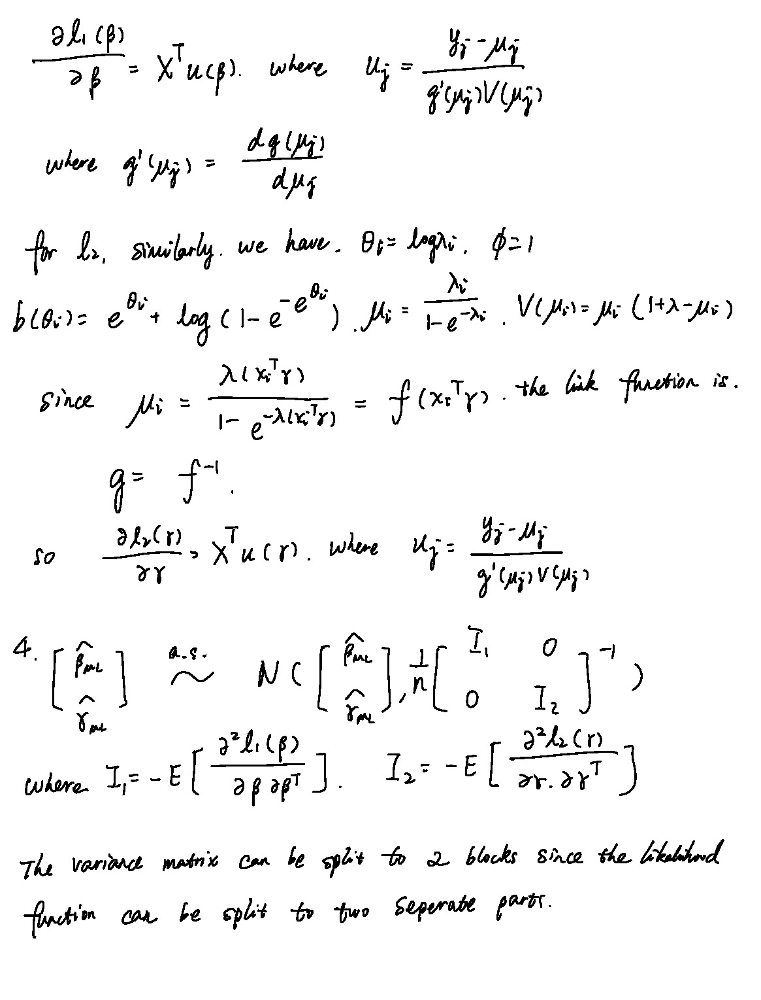

```{r setup, include=FALSE}
knitr::opts_chunk$set(echo = TRUE)
```

## Problem 4

#### Question 1. Fit a Poisson model

```{r}
library(SDMTools)
library(dplyr)
data <- read.table("./docvisits.asc", header = T) %>% select(1:13)
```

```{r}
pmodel = glm(dvisits ~. , data = data, family = poisson)
summary(pmodel)
```

I don't think this model fits the data well, since the residual deviance is not much different from the null deviance so it shows sign of over diversion.

#### Question 2,3,4 (with handwritten solutions)

```{r figure1, echo=FALSE, fig.cap="Q2 - Q4 Handwritten Solutions (Page 1)", out.width = '100%'}

```

```{r figure2, echo=FALSE, fig.cap="Q2 - Q4 Handwritten Solutions (Page 2)", out.width = '100%'}

```

This model set aside $y=0$ as a special case and model all the other values of y using a truncated model. So in this way, we will not let the large number of $y=0$ samples affect our estimation of parameters of the Poisson distribution. Also the parameters can be estimated seperately since two groups of parameters don't influence each other. In other words, we can first fit a binomial model using binary data, then fit a truncated poisson model using truncated Poisson model.


#### Question 5. Fit hurdle model

```{r}
source("./truncpoisson.R")
```

```{r}
summary(VGAM::vglm(formula = dvisits ~ ., data = data %>% filter(dvisits > 0), family = VGAM::pospoisson()))
```

```{r}
trunc_model <- glm(formula = dvisits ~ ., data = data %>% filter(dvisits > 0), family = truncpoisson)
summary(trunc_model)
```

```{r}
binary_data <- data %>%
  mutate(bin_visits = ifelse(dvisits > 0, 1 , 0)) %>%
  select(-dvisits)

bin_model <- glm(bin_visits ~ . , data = binary_data, family = binomial)
summary(bin_model)
```

```{r}
hurdle_model <- pscl::hurdle(dvisits ~. , data = data, dist = "poisson", zero.dist = "binomial", link = "logit")
summary(hurdle_model)
```

The binomial part (zero hurdle model) is exactly the same. However, the truncated poisson part (count model) is different. However, if I use pospoisson as the family in VGAM package, the result is consistent with the hurdle model. A possible reason is that the implementation of truncated poisson is somehow different.

#### Question 6. Model selection

The hurdle model seems to provide a better fit, since it has a smaller AIC as $2*26-2*(-3213)=6478$. The high insurance doesn't seem to increase the number of consultations significantly. However, it's significant that people with levyplus and freerepa will have higher probability of consulations compared with ones using freepoor, since they both have positive slopes and high significance in the zero hurdle model.
